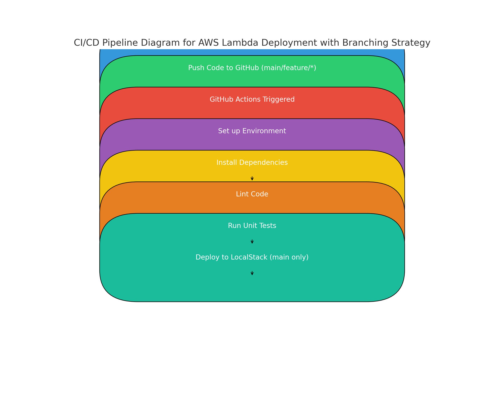

# Lambda CI/CD Automation Deployment

This project demonstrates a CI/CD pipeline to deploy multiple AWS Lambda functions using GitHub Actions and LocalStack.

## Project Structure
- `lambda_functions/`: Contains the Lambda functions and their dependencies.
- `.github/workflows/`: Contains the GitHub Actions workflow for CI/CD.

## Branching Strategy
- **`main` branch**: Triggers the full CI/CD pipeline, including deployment to LocalStack.
- **`feature/*` branches**: Only run tests and linting to validate the code without deploying.

## CI/CD Pipeline Diagram

## CI/CD Workflow
1. Checkout code
2. Set up Python environment
3. Install dependencies
4. Lint code
5. Run unit tests
6. Deploy to LocalStack

## Instructions
1. Ensure LocalStack and a self-hosted runner are set up on your machine.
2. Push changes to the `feature/*` branch Only run tests and linting to validate the code without deploying.
2. Push changes to the `main` branch to trigger the full CI/CD pipeline, including deployment to LocalStack.

## Assumptions
- LocalStack is used to simulate AWS services locally.
- A self-hosted runner is used for executing the workflow.